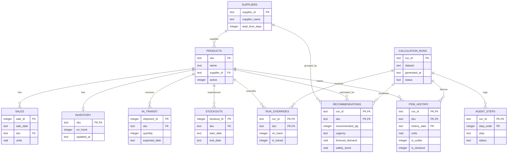

# FruktAI database structure

This is an optional SQLite projection for inspecting CSV source data, calculation runs, recommendations, and workflow logs. CSV remains the MVP source of truth.



## Viewing in Visual Studio Code

1. Open `database/schema.sql` to inspect all tables and constraints.
2. Create a local database with `python scripts/database_cli.py init`.
3. Install any trusted SQLite viewer extension only if you want a graphical table browser.
4. Open `artifacts/fruktai.sqlite` through the extension.
5. Inspect the `latest_recommendations` and `supplier_order_summary` views after data is loaded.

Useful commands:

```bash
python scripts/database_cli.py load --dataset-path data/demo
python scripts/database_cli.py calculate --dataset-path data/demo
python scripts/database_cli.py show recommendations
python scripts/database_cli.py show suppliers
python scripts/database_cli.py show steps
python scripts/database_cli.py show tables
python scripts/test_database.py
```

The repository intentionally stores code and the SQL definition, not a generated binary `.db` file or fake calculation rows. The local database is produced from validated CSV files and real workflow output.

